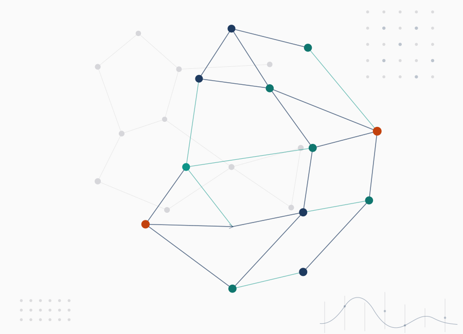

```{=html}
<div class="vera-page">

  <!-- Hero -->
  <section class="vera-hero">
    <div class="vera-container">
      <div class="vera-hero-grid">
        <div class="vera-hero-text">
          <div class="vera-hero-lab-spacer" aria-hidden="true"></div>
          <h1 class="vera-hero-name">Victoria Erofeeva</h1>
          <p class="vera-hero-role">Optimization researcher · distributed intelligence · multi-agent systems · networked control</p>
          <p class="vera-hero-desc">
            I develop mathematically grounded methods for adaptive learning, distributed optimization,
            and coordination in cyber-physical and multi-robot systems—under uncertainty,
            asynchrony, and limited feedback.
          </p>
          <p class="vera-hero-about">
            <a href="about/index.qmd">Read more about me →</a>
          </p>
          <div class="vera-hero-contact">
            <a href="mailto:vicki.ultramarine@gmail.com">Email</a>
            <span>·</span>
            <a href="https://github.com/Ultramarine-x64">GitHub</a>
            <span>·</span>
            <a href="https://www.linkedin.com/in/vicki-erofeeva/">LinkedIn</a>
          </div>
        </div>
        <div class="vera-hero-visual">
          
        </div>
      </div>
    </div>
  </section>
</div>
```
